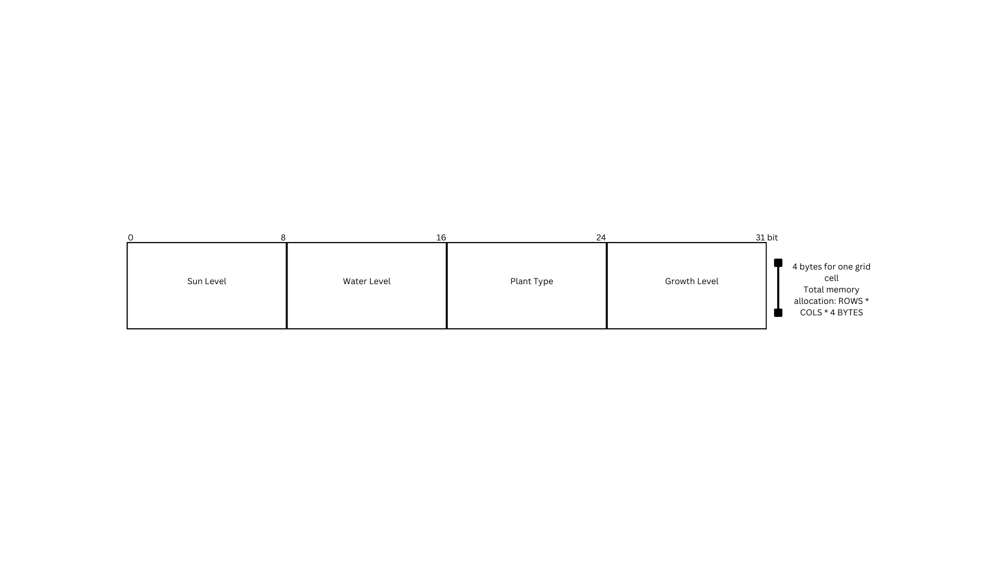

# CMPM121-Final
# Devlog Entry - [12/6/2024]
## How we satisfied the software requirements
### F0+F1+F2
No major changes were made.

### Internationalization
We added JSON files for English, Chinese, Arabic, and Spanish that were defined by all English phrases in our game translated into their respective language. We created a function refreshTexts() that changes all the text to a specified language by calling a reference to the JSON file and finding the translation for the text. In order to support a new language or add a new translatable message to the game, the user should create a JSON file with the translations needed for the language and the functions we created will parse this information.

### Localization
For Chinese, Arabic, and Spanish, we asked Brace "Can you translate these phrases to X language?" and cross-checked with Google Translate to make sure they were somewhat consistent with the message we wanted to display in a different language. The player is given a dropdown to select which language they want to play in.

### Mobile Installation
We followed the [Installable PWA example](https://canvas.ucsc.edu/courses/76391/discussion_topics/647812) provided on Canvas and we were able to add our game to our mobile devices after visiting the website and clicking "Add to home screen". In order to make the game installable, we had to use a manifest.json file to define download behaviors.

### Mobile Play (Offline)
We had to change our style.css to allow the player game size to be consistent across all devices. This was done by scaling using percentages instead of px values. For offline use, it worked with no changes to the manifest.json file.

## Reflection
During the F3 development process, we made an overhaul to how we delivered information to the player. We decided to add new divs to place our save/load buttons, undo/redo buttons, and turn advance buttons. One of the new divs was also used to display grid cell information to the player rather than the information being placed next to the character in-game because that was visual clutter.

# Devlog Entry - [12/2/2024]
## How we satisfied the software requirements
### F0+F1
[F0.f] We have added new spatial rules that affect how plant growth is determined through our new internal plant DSL. They are now determined by the state of the current cell and its neighboring cells.

[F0 + F1] No other major changes were made.

### External DSL for Scenario Design

The design of our external DSL for scenario design utilizes YAML. 
```
StartingConditions:
  PlayerPosition: [2, 2]
  InitialResources:
    Sun: 5
    Water: 10
```
This is our scenario for the player to start at the 3rd row and 3rd column (our first row/col is at [0, 0]). When we parse the YAML file, we set characterPosition to the given playerPosition inside the YAML file.

### Internal DSL for Plants and Growth Conditions

```
export const PlantDSL = {
    "Species A": {
        // Rule: Grows if sun > 3 and water > 8
        growthRules: [
            (cell) => cell.sun > 3,
            (cell) => cell.water > 8
        ]
    },
  /* More plant logic below */
```
In this code snippet, we are using JavaScript to host our internal DSL.
```
const cellData = this.getCellData(row, col); // Retrieve data for this cell
const plantType = cellData.plantType;

// Skip empty cells
if (plantType === "None") continue;

// Retrieve growth rules for this plant type
const rules = PlantDSL[plantType]?.growthRules;
if (!rules || rules.length === 0) continue;

// Check if all growth rules are satisfied
const satisfiesRules = rules.every(rule => rule(cellData, this, row, col));

if (satisfiesRules && cellData.growthLevel !== "Level 3") {
    // Increment growth level
    this.gridData[index + 3]++;
    /* Updating internal grid cell data below */
```
In our PlantDSL, we define the spatial growth rules for each species type we have (A, B, and C). For Species A, the plant may only grow if the grid cell it is in has more than 3 sun and 8 water. This is done by passing `const rules` and `const satisfiesRules` through if-statements to determine whether the plant can level up or not. Our internal DSL does not require parsing through a file like an external DSL would. As such, we can run these functions during runtime to check our grid state, which governs plant growth.

### Switch to Alternate Platform

We started with TypeScript and we changed this programming language to JavaScript. All of our data were able to be carried over to the new platform because TypeScript is a strictly typed language to JavaScript. All of our game logic remained the same because they are based on Phaser APIs which are consistent across both languages. We removed type annotations and updated our interfaces with a typedef instead.

## Reflection
With the new F2 requirements, our team had to add unique growth rules in order to support the F2.b requirement since they had to be structurally different. We have also begun to simplify the UI by adding temporary divs where we will display our save states, so that it does not interfere with the player experience. Similarly, the shift from TypeScript to JavaScript will also simplify how we approach our code structure because JavaScript's lack of type checking allows us to iterate faster during the development process.

# Devlog Entry - [11/27/2024]
## How we satisfied the software requirements
[F1.a] The important state of our game's grid is backed by a single continuous byte array in Array of Structures format. It is Uint8Array called "gridData" that holds the grid's sun levels, water levels, plant type, and growth level. Each part of our
game's grid state is a number so it only takes 1 byte * 4 to hold the data of one grid cell.


[F1.b] We have saveGame() and loadGame() functions that save and load grid data, player position, turn counter, win condition, undo stack, and redo stack. It loads serialized data from grid data that allows us to keep track of our game better from a saved state. The player can click one of the three save/load slots on the bottom of the UI to save/load the game.

[F1.c] We have loadAutoSave() and autoSaveGame() functions that stringify and parse the game state which contains our grid data, player position, turn counter, and win condition. These functions are run every time the player presses 'Next Turn' and every 30 seconds so that the game will auto-save during the important parts of gameplay. We also have a 'beforeunload' event listener to auto-save the game when the browser closes. Similarly, if the local storage contains an auto-save item, the game will ask the player if they want to resume where they were.

[F1.d] We have a primary pushUndoStack() function that saves the current game state and pushes a game state into an undo/redo stack. These stacks are also maintained inside the saveGame() and loadGame() function so players can revert their choices in their saved games. All major actions (moving, planting, harvesting, advancing turn) utilize the pushUndoStack() function which signifies that this action is undoable.

[F0.a-g] Same as last week

## Reflection
Initially, we wanted to focus on adjusting UI so the player could receive better feedback, but the F1 requirements focused on player accessibility so we shifted our focus towards making sure players had the quality of life features: save slots and undo system. We dedicated more time towards creating this rather than creating a more cohesive user experience. In the future, we plan on addressing this issue so that a new user is familiar with what they need to do in the game. We also noticed that a lot of our code is clumped, so we took some time to refactor the code so that some functions aren't completely reliant on others. We will continue to refactor our code as we work on it.

# Devlog Entry - [11/21/2024]
## How we satisfied the software requirements
[F0.a] We created a grid class with a private createGrid() method to initialize our grid cells which also contain information about the sun and water levels. The character is represented by a red square and moves when the player presses an arrow key. Its position is tracked in our update function as this information is needed to display our grid cell data.

[F0.b] We have a 'Next Turn' button that advances time by increasing the water level by a certain amount and resetting the sun level to a random value. This is the only way time passes and plants can grow to a higher level.

[F0.c] When the player moves around the grid, they are limited to interacting with adjacent cells to reap or sow plants. They can sow plants by left-clicking on a space next to them. Similarly, when plants are level 3, they can left-click the plant to reap them.

[F0.d] When players walk over a grid cell, they are presented with how much sun and water levels are in the cell. When the player presses the 'Next Turn' button, the water level will increase by a random amount while the sun level will be randomly reset to a new number. The sun will be used immediately to level up the plant if there is sufficient sun and water at the same time, otherwise, the sun level will be lost.

[F0.e] When the player sows plants, each plant will be given a random species type (A, B, C). Each plant starts at level 1 and is represented by a yellow color. When each plant has enough sun and water to level up, they will turn blue and purple to represent level 2 and level 3 respectively. 

[F0.f] The growth level of each plant is determined by how much sun and water the plant has at the time the player presses the "Next Turn" button. If the plant has at least 3 sun and 10 water, the plant will level up.

[F0.g] The game's win condition occurs when the player has 5 of each species plant at level 3. We implemented this by checking each plant's state after time is advanced. Once the win condition is met, the player is given a win screen and the 'Next Turn' button is replaced with a 'Restart' button.

## Reflection
Initially, our team wanted to create a tower defense game where turns were determined by a planning phase and a fighting phase. However, we realized the fighting phase was going to be an autobattler and it would be out of scope given the time we had to work. We decided to change our game to a gardening game with a space theme that we will work on during polishing since we wanted to focus on getting the primary mechanics down first before devoting more time to asset creation. During our integration with GitHub pages, we also ran into the problem of the website being unable to read TypeScript which was the language we started with. We had to work around this by getting a transcompiler to convert the TypeScript into JavaScript so our page could render.

# Devlog Entry - [11/14/2024]
## Introducing the team

Tools Lead: Frank Shi

Engine Lead: Brady Lin

Engine Assistant: Edwin Fong

Design Lead: Patrick Hu

Design Assistant: Jackie Huang


## Tools and materials

Our team is planning on using the Phaser framework with Typescript for our project. We chose to work with the Phaser framework because we all have
experience using it from CMPM-120. Phaser also builds on the Javascript language and library, which has some ties with 
the Typescript language we've been practicing in CMPM-121.

We're planning to use Typescript, JSON, and HTML for our project. We chose to use these tools because we've been practicing using them
for the majority of the class. These tools are a necessity for creating a well-functioning website, which was another big reason why we 
chose to use them.

The main IDE we're all going to be using is Visual Studio Code and the live server extension built into VSCode. As for the image editor, 
we're planning on using Aseprite and Tiled to create our game's visual assets. The main reason why we chose to use these tools is
because of prior experience using them from CMPM-120.

Our main alternate platform would be transitioning to using Javascript instead of Typescript, but still using the Phaser framework.

## Outlook

We want to try including procedural audio in our game, as well as original music and sound effects. We also want to attempt
to create a more customizable experience for the player in the form of an options menu, as well as giving the player more
accessibility options such as cross-platorm, color blindness mode, subtitles, high-contrast mode, voice narration, and adjustable difficulty levels.

Our main concern is not being able to use certain interfaces for our project.

We're hoping to make our project adaptable and continue to polish our Javascript and Typescript skills. On top of that, we're
hoping to keep our code maintainable.
